# Hevo.Charting.Benchmarks

低代码蓝图子系统优化方案 (§1–§6) 的量化基准。

## 跑

```bash
# 全部 benchmark
cd Hevo.Charting.Benchmarks
dotnet run -c Release -- --filter "*"

# 单组
dotnet run -c Release -- --filter "*ReflectionVsCompiled*"
dotnet run -c Release -- --filter "*BlueprintEndToEnd*"

# 加快/减少迭代 (粗看用)
dotnet run -c Release -- --filter "*" --warmupCount 3 --iterationCount 5
```

> ⚠️ **必须 Release 配置**。Debug 数据没意义。
> ⚠️ 不要传 `--runtimes net10.0`。项目 TFM 是 `net10.0-windows10.0.19041.0`;BDN 0.14 不认识 .NET 10,
> 按宿主 runtime 生成的 boilerplate 是 `net10.0`,引用本项目会 NU1201。`Program.BenchConfig` 已把默认 job 的工具链
> 钉到 `net10.0-windows10.0.19041.0`(`--job dry/short/medium/long` 也在那里映射),不要再手动覆盖。

## A/B 全量对比:origin/main → 本分支(2026-10-09)

- **A** = origin/main `3bce488`。A 的 Benchmarks 还没有本分支的套件,两边统一用 B 的基准代码;
  A 的库里只补了基准代码需要的 4 个纯测量钩子(`ChartCell.RunFrameNow` / `DiscardPendingUpdates` /
  `LastFrameDirtyLayers`、`IncrementalRenderProbe.FrameRendered`,把帧循环拆成 Swap / Run 两段,不改逻辑),没有提交。
- **B** = `b1911b9`(本分支:K 线 LOD、DryRun 端口元数据缓存、GetSnapshot / 摄入器列缓冲的锁外读修复、AutoMap 通知、
  Python handler 让出列读者登记等)。
- 机器:AMD Ryzen 9 9950X3D(16C/32T)、内存 61.6 GB 可用、Windows 11 10.0.26300、.NET 10.0.12、Release、默认 LOH 阈值、
  Workstation/Interactive GC。**远程桌面会话**:WPF 走软件渲染(RenderTier 0,32 Hz),合成 / 上屏数字不代表本机直显;
  帧内 CPU 耗时、分配、GC、计数类指标不受影响。A、B 同机先后跑,没有其它负载。
- 时长:逐帧场景 300 帧 × 5 轮(2000 根 × 1 图,增量模式);Feed / AutoMap / PyFeed 每档 60 s;Blueprint 冷启动 + 5 次热启动;
  Startup JIT / R2R 各 6 个进程取中位;BDN `--job short`。
- 全部数字:[docs/ab/ab.csv](docs/ab/ab.csv)(`suite,scenario,metric,unit,A,B`,348 行)。命令:
  `--render-probe --scenarios=<逐帧场景>,Startup --modes=inc`;`--scenarios=Feed --feed-bars=2000|20000 --feed-rates=100,1000 --feed-seconds=60`
  (AutoMap 加 `--feed-map=source`、只跑 100);`--scenarios=PyFeed --feed-bars=20000 --py-rate=100 --py-indicators=1,4,8 --feed-seconds=60`;
  `--scenarios=Blueprint`;`--filter "*" --job short`。

**结论**

| 方面 | A → B | 原因 |
|---|---|---|
| AutoMap Feed(2000 / 2 万根,100 tick/s) | 帧率 2.0 → 76 / 79 帧/s;tick→帧延迟中位 248 / 249 → 0.2 / 0.7 ms;每帧 Feature 重算 7.5 / 8.0 → 3.5 / 3.7 | A 的 FastSourceMap 原地复用同一块数组再 `WriteIfChanged`,ROM 引用没变 → 长度不变的 tick 不通知,只有新增 K 线时才出帧(**A 上是功能缺陷**)。B 每次写新缓冲 + 按内容判等。B 的分配(5.3 / 21.2 MB/s)是正常出帧的代价 |
| PyFeed(2 万根,1 / 4 / 8 个 Python 指标) | GC 暂停 3.46 / 2.25 / 1.91 → 1.59 / 1.44 / 1.42 ms/s;完成率 88 / 30 / 0 → 92 / 34 / 0 % | Python 调用期间让出列读者登记,不再挡缓冲复用 |
| Feed(C# SMA) | 2 万根 @1000 tick/s GC 暂停 9.35 → 6.48 ms/s;其余分配 / 延迟持平 | 列缓冲按纪元复用 |
| BDN DryRun_50Features | 57.6 µs / 81 KB → 2.25 µs / 3 KB | DryRun 按类型缓存端口元数据 |
| Blueprint 端到端 | 冷启动合计 372 → 345 ms;热启动中位 55 → 50 ms | LaunchEx 持平(冷 62 ms / 热 2 ms),差异在显示 + 布局,远程桌面下波动大,不算结论 |
| Startup 冷启动(装配 + 首帧) | JIT 224 → 216 ms;R2R 194 → 179 ms | — |
| 逐帧场景 | 帧耗时 / 计数基本持平;Zoom 类每帧分配 202–209 → 178–190 KB | K 线 / 折线按物理像素列 LOD |
| DashPan(联动 dashboard 平移) | 每帧 Feature 3.1 → 4.1、分配 58 → 85 KB、帧耗时 0.037 → 0.077 ms | A 的时间轴不跟随平移(74fd952 修的缺陷),B 多出来的是本该有的重绘 |
| 其余 BDN(61 项) | 差异都在 ±25% 噪声内 | — |

**A、B 共有的旧问题,已在 1428775 修复**:上表 PyFeed 2 万根 × 8 个指标完成率 0,是因为 WatchAsync 每次通知都丢一个线程池任务、
不合并,慢指标的调用越积越多、抢 GIL 谁都完不成(还会乱序提交、旧结果覆盖新结果)。改成按订阅 single-flight + 最新值合并后的数字见下文
"PyFeed:2 万根,WatchAsync 合并前后"。

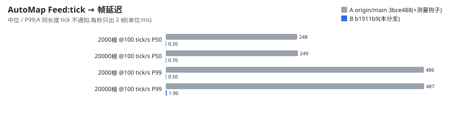

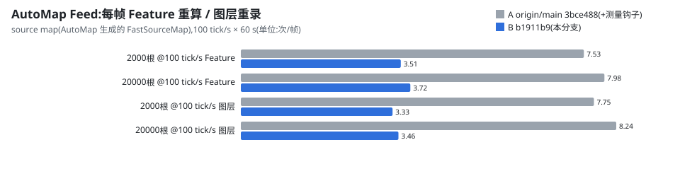

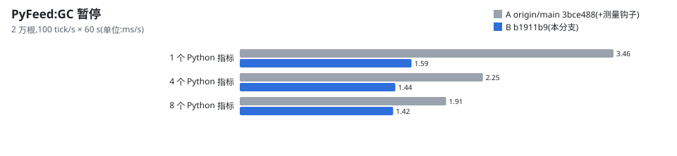
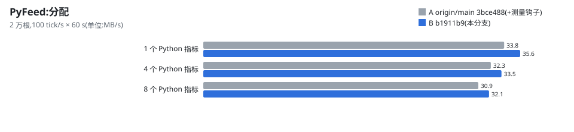
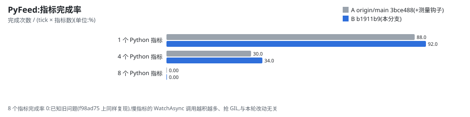
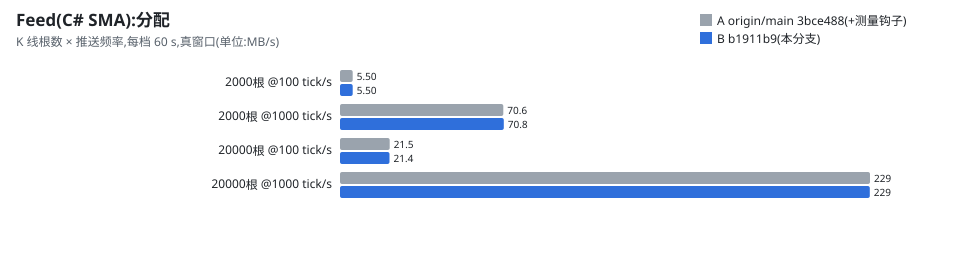
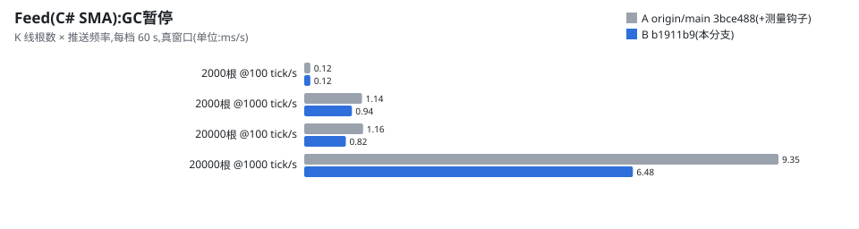
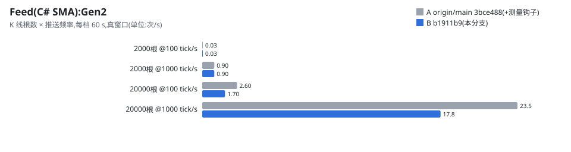
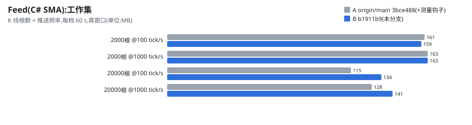
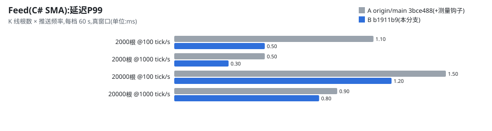
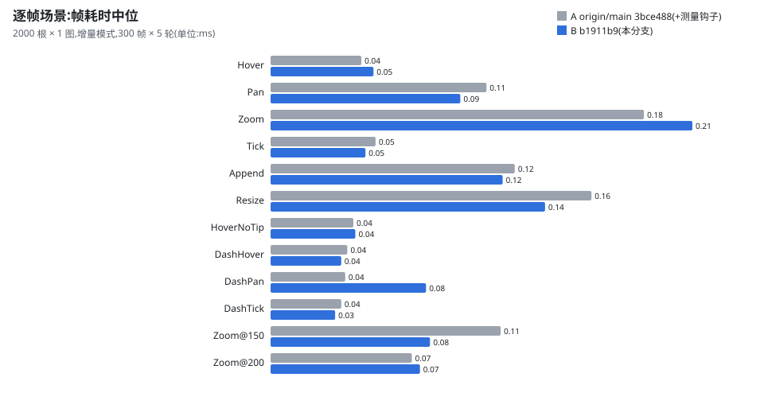
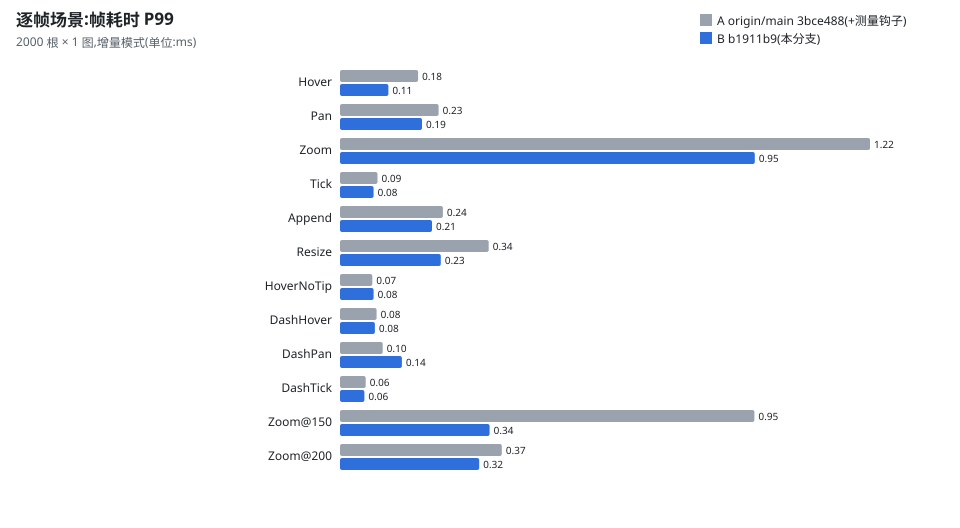
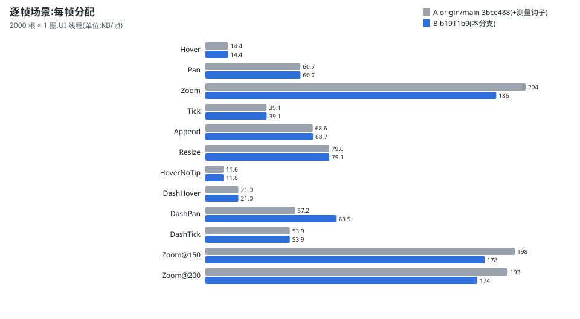
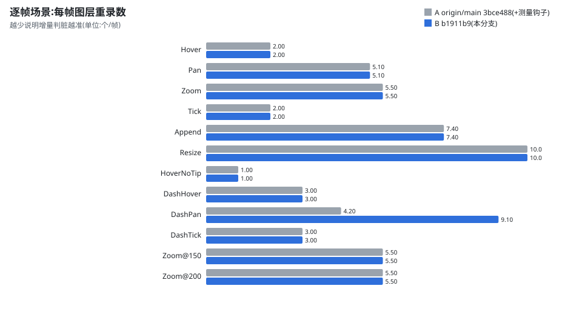
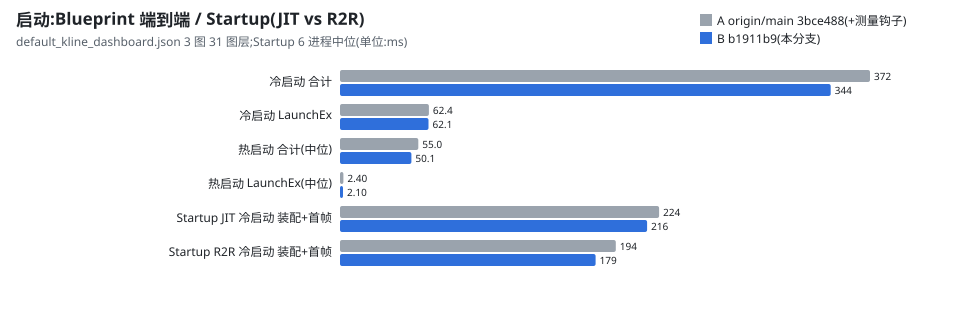
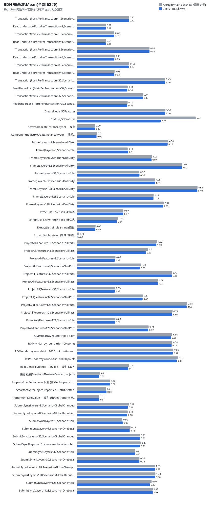

## 实测结果 (.NET 10.0.12, Win11, 5 warmup / 10 iter)

测量机:AMD Ryzen 9 9950X3D(16C/32T),BenchmarkDotNet 0.14.0,2026-10-08。
"旧数据"列是此前 .NET 8.0.26 的实测,**机器不同**,两列差异是 runtime + 硬件的合计,只看量级和相对排序。

### §3 属性 setter 编译化 ([SetterReflectionVsCompiledBenchmarks](ReflectionVsCompiledBenchmarks.cs))

| 路径 | Mean | Allocated | Ratio | 旧数据 (.NET 8) |
|---|---:|---:|---:|---:|
| `PropertyInfo.SetValue` (含 GetProperty,模拟旧 SmartActivator 路径) | 20.4 ns | 40 B | 1.00 (baseline) | 121 ns |
| `SmartActivator.InjectProperties` (编译 setter 缓存) | **14.2 ns** | **0 B** | **0.70** | 58 ns |
| `PropertyInfo.SetValue` (无 GetProperty,直接写) | 6.7 ns | 0 B | 0.33 | 33 ns |

**结论**:编译 setter 仍比"GetProperty + SetValue"快且零分配,但 .NET 10 下反射路径本身快了很多,
差距从 2.1× 缩到 1.4×。50 Feature × 5 prop = 250 次注入:旧路径 ~5μs + 10KB / 新路径 ~3.6μs + 0B,
收益主要剩"零分配"。

### §4 Seed 编译委托缓存 ([SeedDispatchReflectionVsCompiledBenchmarks](ReflectionVsCompiledBenchmarks.cs))

| 路径 | Mean | Allocated | Ratio | 旧数据 (.NET 8) |
|---|---:|---:|---:|---:|
| `MakeGenericMethod + Invoke` (每次) | 116.6 ns | 232 B | 1.00 (baseline) | 589 ns |
| 缓存的 `Action<IFeatureContext, object>` | **6.6 ns** | **0 B** | **0.06 (17.6× faster)** | 38 ns |

**结论**:Seed dispatch 的核心成本是 `MakeGenericMethod` 跟 `Invoke` 的 box arg 数组分配。
编译委托 ~18× 快 + 完全消除 232B/调用的分配。InitialTraits 多于 5 个的蓝图收益最明显。

### §2 ctor 编译委托 ([CtorReflectionVsCompiledBenchmarks](ReflectionVsCompiledBenchmarks.cs))

| 路径 | Mean | Allocated | Ratio | 旧数据 (.NET 8) |
|---|---:|---:|---:|---:|
| `Activator.CreateInstance(type)` | **4.2 ns** | 24 B | 1.00 (baseline) | 14 ns |
| `ComponentRegistry.CreateInstance(type)` (编译委托缓存) | 5.3 ns | 24 B | 1.24 (slower) | 25 ns |

**结论 (诚实交代)**:.NET 8 / 10 的 `Activator.CreateInstance(Type)` 内部已经做得很好,
我们的 `ConcurrentDictionary.GetOrAdd → Func<object> invoke` 仍比它慢约 1ns(.NET 8 上是 11ns)。

但这是**空 POCO** 的微基准,放大了 dispatch 比例。真实业务里:
- LineSeriesFeature 的 ctor 本身 ~50μs(各种字段、PortGenerator 注册),dispatch 占比 <1%,
  反射 vs 编译差异淹没在 ctor 自身工作里 —— 改造无害也无观察收益。
- 优化的真正价值在**避免反射通道在 .NET 5 / 老运行时上的不稳定**(README §2 兼容线),
  以及统一 dispatch 路径让上层 (SmartActivator / BlueprintLauncher) 代码更干净。

**保留这条优化**,因为:① 一致性 ② 在更老 runtime 上 Activator 没这么快 ③ 自带缓存防 ctor lookup 重复。

### §1 端口元数据缓存 + §5 DryRun ([BlueprintEndToEndBenchmarks](BlueprintEndToEndBenchmarks.cs))

50 Feature 蓝图实测:

| Benchmark | Mean | Allocated | 旧数据 (.NET 8) |
|---|---:|---:|---:|
| `CreateNode_50Features` (端口扫描走缓存命中) | **3.6 μs** (~70 ns/node) | 14.5 KB | 15-17 μs / 14 KB |
| `DryRun_50Features` (诊断 50 Feature 的端口冲突 / 未焊接) | **2.3 μs** (~46 ns/feature) | 2.9 KB | 110-121 μs / 23 KB |

**结论**:
- §1 的 NodePortCache 让端口扫描收敛到 ConcurrentDictionary 查找 + Node 实例分配,
  ~70ns/node 主要是 Guid 生成 + Properties dict alloc,反射开销几乎消失。
- §5 的 DryRun 在 50 Feature 蓝图上 ~2μs 一次 —— Launcher 入口跑一次诊断,
  把"加载成功但黑屏"的隐性故障早期暴露出来,RoI 极高。
- DryRun 曾有一次回归,同机同运行时(.NET 10,旧提交临时改 TFM 编译,InProcess + MemoryDiagnoser)对比:

  | 提交 | DryRun Mean | Allocated |
  |---|---:|---:|
  | bba2322(上表 .NET 8 旧数据对应的提交) | 26.9 μs | 22.5 KB |
  | ef87be9 | 25.4 μs | 22.5 KB |
  | 0402be0 ~ 3bce488 | 64.8 – 74 μs | 79.3 KB |
  | 修复后 | **2.3 μs** | **2.9 KB** |

  来源是 0402be0 往 DryRun 新增的 4 项校验(Output 未接 AutoScale、多输入 InputOrder、IncrementalCompute handler、
  Plot series):每个 Feature 要 Resolve 类型 2 次、`GetProperties` 3 次(每次返回新数组)、`GetCustomAttribute`
  反复实例化,加上 LINQ 闭包和总会创建的 HashSet。修复按 Feature 类型缓存端口元数据(DataPort 属性 + 方向 +
  dict 输入端口,`PortMetadataRegistry` 登记变化时失效),三处校验共用,顺带把 bba2322 时代就有的
  每次反射开销也一并去掉了。诊断结果由 `BlueprintDryRunGoldenTests` 快照锁定,前后逐条一致。
  (此前本文写过"DryRun 耗时反而降了",那是拿另一台机器上的 .NET 8 旧数做的比较,结论错误,以本表为准。)
- §8 数组化后 DryRun 不变(在噪声内),证明新格式没拖慢 hot path。

### §D2.X Python marshalling round-trip ([PythonMarshallingBenchmarks](PythonMarshallingBenchmarks.cs))

ROM&lt;double&gt; ↔ numpy.ndarray round-trip 跨边界开销,4 个 size:1 / 100 / 1000 / 10000 点。

```bash
dotnet run -c Release --project Hevo.Charting.Benchmarks -- --filter "*PythonMarshalling*"
```

⚠️ **InProcess 必须开**(已在文件里 `[Config(typeof(InProcessConfig))]` 配好):BDN 默认 spawn 子进程,
子进程 BaseDirectory 不在 repo 内 → ResolveDll 找不到 Python312/python312.dll → GlobalSetup throw → benchmark NA。
InProcess 让 benchmark 在主进程内跑(共享 PythonEngine 全进程 single-init 状态)。

**实测**(.NET 10.0.12,Ryzen 9 9950X3D,Python 3.12;原先的预估一并列出):

| size | Mean | Allocated | 原预估 Mean |
|---|---:|---:|---:|
| 1 点 | **6.0 μs** | 1.6 KB | ~50-100 μs |
| 100 点 | **6.4 μs** | 2.4 KB | 同上 |
| 1000 点(time-share 典型) | **8.3 μs** | 9.4 KB | ~60-120 μs |
| 10000 点 | **10.4 μs** | 79.7 KB | ~80-150 μs |

**结论**:
- 实测比预估低一个数量级。固定成本(GIL + Marshal + 调度)约 6μs,数据量从 1 到 1 万点只多出约 4μs,
  分配随点数线性增长(1 万点约 80KB,已接近 LOH 阈值)。
- 指标算子层(1-10Hz)完全够用。按实测,单次 round-trip 约占 60Hz 帧预算(16.7ms)的 0.04-0.06%,
  原来"热路径每帧 6-9% 帧预算"的判断不成立;但这个基准是单线程、无 GIL 竞争、Python 侧不做计算的纯搬运,
  §D2.X 的热路径划线要不要放宽,得拿真实算子 + 并发场景再测。
- zero-copy(待 D2.5.3 优化)真正受益的 case 是 10K+ 点指标,那时 Marshal.Copy 和 80KB 分配才显著。

### §8 PortBindings 解析 ([PortBindingValueBenchmarks](PortBindingValueBenchmarks.cs))

5 个 globalId 的扇入端口三种输入形态对比:

| Benchmark | Mean | Allocated | Ratio | 旧数据 (.NET 8) |
|---|---:|---:|---:|---:|
| `ExtractList: CSV 5 ids (老格式)` | 72.9 ns | 424 B | 1.00 (baseline) | 610 ns / 568 B |
| `ExtractList: List<string> 5 ids (新格式)` | **40.5 ns** | **192 B** | **0.56 (1.8× faster, 55% 少分配)** | 388 ns / 336 B |
| `ExtractList: single string (退化)` | 4.4 ns | 32 B | 0.06 | 30 ns |
| `ExtractSingle: string (单端口典型)` | **≈0 ns** (低于计时分辨率) | **0 B** | - | 5 ns |

**结论**:新数组格式比老 CSV 1.8× 快 + 减 55% 分配 —— 省了一次 `string.Split + Trim + Where` 链的临时对象。
但绝对值只在几十 ns 量级,落到 50 Feature 蓝图的加载流程里占比很小,优化主要价值在
**JSON 可读性 / diff 友好 / AI 生成正确率**,perf 是顺手红利。

## 总评

| § | 描述 | 实测收益 (.NET 10) | 评估 |
|---|---|---|---|
| §1 | 端口元数据缓存 | ~70 ns/node (反射开销近消失) | ✅ 编辑器手感 |
| §2 | ctor 编译委托 | 微基准 +1 ns(略慢于 Activator) | ⚠️ 维持代码一致性,无业务收益 |
| §3 | setter 编译化 | **1.4× faster + 0 alloc**(.NET 8 上 2.1×) | ✅ 蓝图加载阶段 GC 减压 |
| §4 | Seed 编译委托 | **17.6× faster + 0 alloc** | ✅ 高 Trait 蓝图明显提速 |
| §5 | DryRun 早期诊断 | 50 Feature ~2.3μs / 2.9KB(修复 0402be0 回归后) | ✅ 调试时间省分钟级 |
| §7 | JsonConverter | 2 个 leaf converter 撑住整个 trait 树 | ✅ AI 生成 / diff 友好 |
| §8 | PortBindings 数组化 | 老 CSV → 新数组,**1.8× faster + 55% 少分配** | ✅ JSON 可读性主升,perf 顺手红利 |

实事求是:
- **§3 §4 §8 是真实 perf 优化**,§7 是 AI / 可读性优化,§5 是工程价值,§1 是编辑器交互优化
- **§2 在 .NET 8 / 10 上意义有限** (.NET 5 / 老 runtime 上仍有意义,且统一了 dispatch 路径)
- **§3 的收益随 runtime 进步在缩小**:.NET 10 反射 setter 已经很快,剩下的主要是零分配
- **§7 的"少做"**:`LineStyle` / `AxisStyleTrait` 不需要单独写 converter ——
  顶层多态 (IHevoBrush) + 叶子值类型 (Color) 各自有 converter,中间普通 record 由 System.Text.Json
  默认 primary ctor 反序列化处理,组合即可。这把"每个 trait 单独 converter"的工作量从 "n 个" 降到 "2 个"。

## 结果产物路径

每次跑后,markdown / csv / html 在 `BenchmarkDotNet.Artifacts/results/` 下:

```
Hevo.Charting.Benchmarks.SetterReflectionVsCompiledBenchmarks-report-github.md
Hevo.Charting.Benchmarks.SeedDispatchReflectionVsCompiledBenchmarks-report-github.md
Hevo.Charting.Benchmarks.CtorReflectionVsCompiledBenchmarks-report-github.md
Hevo.Charting.Benchmarks.BlueprintEndToEndBenchmarks-report-github.md
Hevo.Charting.Benchmarks.PortBindingValueBenchmarks-report-github.md
Hevo.Charting.Benchmarks.PythonMarshallingBenchmarks-report-github.md
Hevo.Charting.Benchmarks.SubmitSyncBenchmarks-report-github.md        # 增量核心组,见下文
Hevo.Charting.Benchmarks.ProjectAllBenchmarks-report-github.md
Hevo.Charting.Benchmarks.FrameScalingBenchmarks-report-github.md
Hevo.Charting.Benchmarks.BlackboardTransactionBenchmarks-report-github.md
```

## 增量渲染前后对比 (`--render-probe`, [RenderProbe](RenderProbe.cs))

不是 BenchmarkDotNet:要真窗口和完整 WPF 管线,所以单独一个入口。只测 **UI 线程的 CPU 管线**;
渲染线程合成上屏和输入延迟见下一节 `--latency-probe`。

```bash
cd Hevo.Charting.Benchmarks
dotnet run -c Release -- --render-probe                                  # 2000 根 × 1 张图,全部场景和模式,5 轮
dotnet run -c Release -- --render-probe --bars=2000,20000,100000          # 数据量伸缩曲线
dotnet run -c Release -- --render-probe --charts=1,4,9 --modes=inc,full,inc-par,full-par   # 多图并行 + PlotMode.Parallel
dotnet run -c Release -- --render-probe --scenarios=Hover,Zoom --rounds=10 --out=out/probe.csv
```

| 参数 | 默认 | 说明 |
|---|---|---|
| `--bars=` | 2000 | K 线根数,逗号分隔可扫多个 |
| `--charts=` | 1 | 同一窗口里的图数(UniformGrid 排布,各自独立 schema / 黑板),逗号分隔可扫多个 |
| `--steps=` / `--warmup=` / `--rounds=` | 300 / 100 / 5 | 每轮每组合的测量帧数 / 预热帧数 / 轮数 |
| `--scenarios=` | 六个基础场景 + Startup | 逐帧:`Hover,Pan,Zoom,Tick,Append,Resize`,扩展逐帧:`HoverNoTip,DashHover,DashPan,DashTick,Zoom@150,Zoom@200`;套件:`Feed,PyFeed,Blueprint,Soak`;`Startup`;`all` = 除 `Soak` 外全部(见下文"扩展场景") |
| `--modes=` | 全部 | `inc,nobag,layerfull,featfull,full,inc-par,full-par` |
| `--window=` | 1280x720 | 图表区域尺寸(定在内容上,窗口 SizeToContent) |
| `--out=` | render-probe.csv | 逐帧明细;同名 `.md` 汇总表、`.json` 汇总数据 |
| `--baseline=` / `--write-baseline=` / `--tolerance=` | - / - / 0.02 | 计数回归门槛(见下面 CI 一节) |
| `--ci` | | CI 预设:只跑 `inc`,全部逐帧场景(含扩展)120 帧 × 1 轮,图表区 960x540,无 Startup / 套件 |
| `--alloc-types` | | 进程内订阅 GCAllocationTick,按类型 + SOH/LOH 汇总每帧分配(UI 线程,含脚本输入),追加到 `.md`。用来查"分配/帧"的大头 |
| `--heavy-layers=` / `--heavy-ms=` | 0 / 1 | 每张图额外挂 N 个人为加重的图层(每层录制忙等 X ms,纯 CPU),测 `PlotMode.Parallel` 用 |
| `--feed-rates=` / `--feed-seconds=` / `--feed-bars=` | 100,500,1000 / 5 / 2000 | `Feed` 套件的推送频率(tick/s)、每档测量秒数、历史 K 线根数;表里另报 GC 暂停(ms/s)与工作集,环境变量 `DOTNET_GCLOHThreshold` 会写进标题 |
| `--py-indicators=` / `--py-rate=` | 1,4,8 / 100 | `PyFeed` 套件同时挂的 Python 指标数、推送频率 |
| `--blueprint-runs=` | 5 | `Blueprint` 套件冷启动之后的热启动次数 |
| `--soak-minutes=` / `--soak-rate=` | 10 / 100 | `Soak` 长跑分钟数、推送频率(CI 不跑) |

**图表**:跟 LowCodeDemo `KLineMainSchema` 同款装配(蜡烛 + SMA20 + 时间轴 + 价格轴 + 联动头 + 标准交互),
数据是固定种子的随机游走,黑板由脚本直接写。

**场景**(每步改一次黑板,再手动跑一帧 `ChartCell.RunFrameNow`,跟 `CompositionTarget` 回调里那一帧是同一段代码,
含 `RequestUpdate` 排队的事务,不受 VSync 节奏影响):

| 场景 | 每步做什么 |
|---|---|
| Hover | 十字光标在绘图区横扫,每步 3px,写 `PointerHitPort`(命中计算复刻 `ChartInteractionFeature`) |
| Pan | 平移 1 根 K 线,写 `Viewport.UserRange`,每 100 步换方向 |
| Zoom | 滚轮缩放:右缘锚定,可见跨度每步 ×1.1,在 60 根和 min(数据量, 20000) 根之间来回 |
| Tick | 最后一根 K 线收盘价跳动,`ForceWrite` High/Low/Close |
| Append | 实时追加:每步新收一根 K 线,所有序列长度 +1,视口跟随最新一根 |
| Resize | 图表宽度每步变 8px(走真实 WPF 布局 → `SizeChanged` → 环境纪元 → FullPass) |
| Startup | 单独成表:新建窗口 → 模板装配(ComposeAll)→ 写数据 → 首帧出图,冷启动(首次,含 JIT)和热启动分开报 |

**模式**(`DevTools/IncrementalRenderProbe` 的静态开关,默认全关,关着时行为跟原来一致):

| key | 模式 | 含义 |
|---|---|---|
| inc | 增量(默认) | 现状 |
| nobag | 去掉Bag短路 | 关掉 `RenderContext.SubmitSync` 的 Bag 级短路,图层仍做引用比对。验证短路只是省 CPU,不改变重绘集合 |
| layerfull | 图层侧全重绘 | 已发现的图层每帧都重录(关掉 `VisualDependencyTracker` 判脏) |
| featfull | Feature侧全量 | 每帧都当作环境纪元变化,所有 Feature 重投影、`UsePort` 全部视为变脏 |
| full | 全量(两侧都关) | 上面两项同时打开,相当于没有增量机制 |
| inc-par / full-par | +Parallel | 同 inc / full,但图层录制走 `PlotMode.Parallel`(脏图层 ≥3 时 `Parallel.ForEach`) |

**统计与标准化**:
- 进程 High 优先级、UI 线程 Highest;每个组合先预热一遍,再歇 300ms 让后台 Tier1 编译落地。
- 每个组合跑 `--rounds` 轮,轮与轮之间穿插(第 1 轮的所有组合 → 第 2 轮 ...),机器状态漂移对各组合影响一致。
- 帧耗时报"各轮中位数的均值 ± 95% 置信区间"(t 分布),另报全部样本的 P95 / P99;每千帧 Gen0/1/2 GC 次数。
- 计数(Feature 重算/帧、图层重录/帧、绘制命令/帧)各轮应完全一致,不一致的会标 ⚠。
- 开头打印测量环境:CPU、GPU、WPF RenderTier、是否远程桌面、刷新率、DPI。**远程桌面下 WPF 走软件渲染**,
  CPU 管线数字仍可比,但不代表本机显示器 + GPU 的体验,正式数据请在本机直接显示时跑。

"帧耗时"只算 UI 线程这一帧(排队事务 + Feature 投影 + 判脏 + 图层录制 + 上屏指令派发),
不含 WPF 渲染线程合成和 GPU 时间;"输入耗时"是写黑板 / 改尺寸本身,含同步 `Watch` 副作用(视口钳位、自动量程)和布局。

> ⚠️ 必须 Release。DEBUG 下每个 schema 都挂拓扑追踪器,每次读写都有记录开销。

### 实测 (render-probe)

> ⚠️ **以下实测数据的环境**:Ryzen 9 9950X3D,.NET 10.0.12,2026-10-08,**远程桌面会话**
> (GPU = Microsoft Remote Display Adapter,WPF **RenderTier 0 软件渲染**,刷新率 32Hz)。
> render-probe 只测 UI 线程 CPU 管线,数字可比;**本机直显 + GPU 下的数据和 `--latency-probe` 结果待补**。

**2000 根 × 1 张图**(默认参数,300 帧 × 5 轮,1280x720;帧耗时 = 各轮中位数的均值,单位 ms;LOD 优化前测得,Zoom 的前后对比见下文):

| 场景 | 增量 帧耗时 | 全量 帧耗时 | 增量 Feature重算 / 图层重录 每帧 | 全量 Feature重算 / 图层重录 每帧 | 增量 分配/帧 |
|---|---:|---:|---:|---:|---:|
| Hover | **0.030** | 0.112 | 3 / 2 | 12 / 10 | 14.6 KB |
| Pan | **0.052** | 0.073 | 3 / 5.1 | 12 / 10 | 61.8 KB |
| Zoom | 0.101 | 0.100 | 3.3 / 5.5 | 12 / 10 | 209 KB |
| Tick | **0.020** | 0.064 | 1 / 2 | 12 / 10 | 40.0 KB |
| Append | **0.047** | 0.064 | 6.2 / 7.4 | 12 / 10 | 69.8 KB |
| Resize | 0.061 | 0.060 | 12 / 10 | 12 / 10 | 80.5 KB |

- Resize 走环境纪元 FullPass,增量和全量本来就一样。
- `inc-par` / `full-par`(PlotMode.Parallel)在所有组合里都没有收益,全量时略慢(单图 10 个图层,并行调度开销盖过收益)。
- Startup:冷启动 装配 167 ms / 首帧 49 ms;热启动 装配 14.3 ms / 首帧 0.94 ms(2000 根,10 个图层)。
- ReadyToRun 发布(`dotnet publish -c Release -p:PublishProfile=ReadyToRun`)跟普通 JIT 构建交替各跑 6 个进程,
  中位数:冷启动 装配 187 → 161 ms、首帧 54.5 → 33 ms,合计 **~242 → ~194 ms**(-20%),波动也小了(JIT 偶发 256 ms);
  热启动不变。剩下 ~160 ms 装配不是本仓库代码的 JIT(WPF 框架本身已是 R2R),要再压得先抓启动 trace。

**数据量伸缩**(`--bars=2000,20000,100000`,3 轮,增量 / 全量,帧耗时 ms,K 线 LOD 优化后):

| 场景 | 2000 根 | 2 万根 | 10 万根 |
|---|---:|---:|---:|
| Tick | 0.018 / 0.069 | 0.018 / 0.066 | 0.018 / 0.062 |
| Pan | 0.113 / 0.110 | 0.042 / 0.063 | 0.061 / 0.073 |
| Zoom | 0.085 / 0.098 | 0.215 / 0.227(P99 0.49) | 0.195 / 0.214(P99 0.52) |

Tick / Pan 跟数据量无关(只碰最后一根 / 可见窗口固定 ~120 根)。Zoom 的可见跨度在 60 根和 min(数据量, 2 万) 根之间来回,
大跨度帧由下面的按像素列 LOD 兜住。

**K 线 / 折线按像素列 LOD**([PixelColumnLod](../Hevo.Charting/Renderers/PixelColumnLod.cs)):
单根宽度不足 1 个物理像素(按 DPI 换算)时,CandleLayer 把落在同一物理像素列的 K 线聚合成一根(首开、最高、最低、末收,
涨跌色按聚合后的开收),LineLayer 对折线做 M4 抽稀(每列留首 / 最低 / 最高 / 末),输出量上限 ≈ 绘图区物理宽度;
≥1px 时走原逐根路径,行为不变。优化前 2 万根可见时每帧上 MB 的分配几乎全是 WPF 内部缓冲
(2 万 figure 的影线 StreamGeometry、2 万次 `DrawRectangle` 的 RenderData 和依赖资源列表),单个最大 1.4 MB 进 LOH。

同参数前后对比(`--bars=2000,20000,100000 --scenarios=Zoom,Pan,Tick --modes=inc,full --rounds=3 --alloc-types`,增量模式):

| Zoom | 帧耗时中位 | P95 | P99 | 分配/帧 | 其中 LOH | Gen0/1/2 每千帧 |
|---|---:|---:|---:|---:|---:|---:|
| 2000 根 优化前 → 后 | 0.139 → 0.085 | 0.47 → 0.34 | 0.75 → 0.44 | 213 → 185 KB | - | 6.7/3.3/3.3 → 3.3/0/0 |
| 2 万根 优化前 → 后 | 0.221 → 0.215 | **3.08 → 0.44** | **3.90 → 0.49** | **1066 → 291 KB** | **~730 → ~41 KB**(单个 ≤86 KB) | **70/67/67 → 3.3/0/0** |
| 10 万根 优化前 → 后 | 0.200 → 0.195 | **2.96 → 0.45** | **4.15 → 0.52** | **1067 → 293 KB** | 同上 | **38/34/34 → 3.3/0/0** |

- 中位数基本不变:Zoom 一半以上的帧可见跨度只有几十到几百根,本来就不触发 LOD;收益集中在大跨度帧的尾部(P95/P99)和 GC。
- Pan / Tick 前后一致(帧耗时、计数、分配都在噪声内),LOD 不影响常规缩放级别。
- 剩下的 ~41 KB/帧 LOH 是 ~1280 列实体的 RenderData 缓冲刚好越过 85 KB 阈值;Gen2 已归零,暂不再压。
- CI 计数基线随之更新:只有 `Zoom|inc` 的绘制命令/帧 22.17 → 22.73(命令数按批次计,跟根数无关),其余组合不变。
**多图**(`--charts=1,4,9`,Hover,3 轮,增量 / 全量,帧耗时 ms):1 图 0.067 / 0.326,4 图 0.083 / 0.245,9 图 0.192 / 0.504。

完整表(含 P95/P99、GC、置信区间)见 `--out=` 输出的 `.md`。

### 扩展场景与套件

> 环境同上:远程桌面 + RenderTier 0 软件渲染,本机直显 + GPU 下待补测。所有测量窗口都设了 `IsHitTestVisible=false`
> (窗口在屏幕正中,真实鼠标停在上面时 WPF 合成的 MouseMove 会让十字光标 / tooltip / 标题栏跟着重算,计数随鼠标位置漂移)。

**逐帧扩展场景**(`--scenarios=Hover,HoverNoTip,DashHover,DashPan,DashTick,Zoom,Zoom@150,Zoom@200 --modes=inc,full --rounds=3`,
2000 根,1280x720,增量 / 全量;帧耗时中位 ms,计数 = Feature 重算 / 图层重录 每帧):

| 场景 | 窗口 | 增量 帧耗时 | 全量 帧耗时 | 增量 计数 | 全量 计数 | 增量 分配/帧 |
|---|---|---:|---:|---:|---:|---:|
| Hover | 标准主图(含 Tooltip) | 0.067 | 0.328 | 3 / 2 | 12 / 10 | 15.0 KB |
| HoverNoTip | 同上,摘掉 TooltipWidgetFeature | **0.017** | 0.084 | 2 / 1 | 11 / 9 | 11.9 KB |
| DashHover | 联动 dashboard:主图 + scatter/arrow/text 标记 + 成交量副图 | 0.039 | 0.127 | 5 / 3 | 22 / 17 | 21.7 KB |
| DashPan | 同上 | 0.078 | 0.139 | 4.1 / 9.1 | 22 / 17 | 85.5 KB |
| DashTick | 同上(主图收盘价 + 副图成交量跳动) | 0.043 | 0.134 | 2 / 3 | 22 / 17 | 55.2 KB |
| Zoom | 标准主图 | 0.355 | 0.353 | 3.3 / 5.5 | 12 / 10 | 190 KB |
| Zoom@150 | 模拟 150% DPI | 0.082 | 0.094 | 3.3 / 5.5 | 12 / 10 | 183 KB |
| Zoom@200 | 模拟 200% DPI | 0.063 | 0.075 | 3.3 / 5.5 | 12 / 10 | 178 KB |

- **Tooltip**:Hover 时 tooltip 确实上屏(帧末 TooltipWidgetLayer 的 widget 指令非空的帧占比:Hover / DashHover 100%,HoverNoTip 0%)。
  它是 WPF 控件(Border + TextBlock,每帧改文本 + Measure),一张图 Hover 帧 0.067 ms 里约 0.05 ms 花在它身上,
  去掉后 Hover 帧降到 0.017 ms。
- **dashboard**:副图十字光标通过 linkedHit 联动(DashHover 3 层 = 主图十字光标 + tooltip + 副图十字光标);
  DashPan 主图时间轴 + 三类标记层 + 副图柱状图跟着重录。这个场景发现了"联动主图时间轴不跟随平移"的 bug,已单独修复(见 git log)。
- **高 DPI 模拟**:内容按 1/scale 的 DIP 尺寸布局、`LayoutTransform` 放大回原像素,再走 ChartCell 自己的 `OnDpiChanged`
  把 PixelsPerDip 设成 scale(跟真实换屏同一条路径)。局限:WPF 仍按系统 DPI 光栅化,文字 hinting 跟真 150% / 200% 屏不同;
  测的是"DIP 布局变小 + 按物理像素做 LOD"的 CPU 管线。150% / 200% 下 Zoom 的绘制命令 / 分配随可见物理列数一致变化,LOD 分支按物理像素生效。
  (标准 Zoom 0.355 ms 是该窗口第一个测的 Zoom 组合,轮间置信区间 ±0.40 ms 很宽,量级看 Zoom@150 / @200 即可。)

**Feed:实时数据源链路**(`--scenarios=Feed`):`ReactiveDataSource` 先灌 2000 根历史,后台线程按固定频率 `UpdateBuffer`
(加锁改 buffer → Publish → pipe 的 Ingestor 写黑板 → `ChartCell.RequestUpdate`)→ `ComputeFeature` 后台算 SMA20 → 上屏。
每 50 个 tick 收一根新 K 线。窗口用真 `CompositionTarget` 节奏(不手动跑帧)。延迟 = tick 推入 → 含该 tick 的那一帧 UI 线程做完。

| 推送频率 | 帧/s | tick/帧 | 延迟中位 / P95 / P99(ms) | 分配(MB/s) | GC 0/1/2 每秒 | CPU(全核 %) |
|---:|---:|---:|---:|---:|---:|---:|
| 100/s | 76 | 1.3 | 0.4 / 0.8 / 1.0 | 5.4 | 0 / 0 / 0 | 3.7 |
| 500/s | 499 | 1.0 | 0.2 / 0.3 / 0.7 | 32.4 | 0.8 / 0 / 0 | 7.0 |
| 1000/s | 1000 | 1.0 | 0.2 / 0.3 / 0.5 | 65.6 | 2.4 / 0.8 / 0.8 | 7.0 |

⚠️ 远程桌面 + 软件渲染下 `CompositionTarget.Rendering` 不按显示刷新率节流:1000 tick/s 时 UI 线程真的跑了 ~1000 帧/s,
所以延迟只有亚毫秒。本机 GPU 直显时 WPF 按 vsync(60Hz)出帧,同样负载会变成"每帧合并十几个 tick、延迟 0–16 ms",
这组数**不能**当本机体验看,只说明 UI 线程管线本身扛得住每秒上千次更新。

**PyFeed:Python 指标**(`--scenarios=PyFeed`):同上链路,再挂 N 个 Python 指标(RSI14 / EMA20 交替,纯 Python 循环跑 2000+ 根),
各自一个 `ComputeFeature`,后台并发调用,抢同一把 GIL。100 tick/s:

| 指标数 | 单次调用 中位 / P95(ms) | 指标完成次数 / (tick × 指标数) | 延迟中位(ms) | 分配(MB/s) | CPU(全核 %) |
|---:|---:|---:|---:|---:|---:|
| 1 | 1.53 / 2.97 | 100% | 0.3 | 7.7 | 5.3 |
| 4 | 2.62 / 6.37 | 100% | 0.4 | 14.3 | 3.2 |
| 8 | 4.71 / 12.65 | 100% | 0.3 | 23.4 | 5.6 |

- 单次调用随并发指标数上涨(1 → 8 个:1.5 → 4.7 ms,P95 3 → 12.7 ms),是 GIL 排队;CPU 始终 ~2 个核,不随指标数增加。
- 100 tick/s 下 8 个指标仍 100% 跟得上(Python 总耗时 ≈ 8 × 1.5 ms ≈ 12 ms/tick,已逼近 10 ms 的 tick 间隔),
  再加指标或提频率就跟不上:合并前(7f305af 及更早)每次通知都排一个任务,调用堆积;合并后每个订阅同时只跑一次、
  跑完再算最新的一份,指标线滞后于 K 线 ≈ 一次调用耗时(见下面 2 万根的数字)。
- tick → 帧延迟不受影响:指标在后台算,K 线不等它上屏;指标线比 K 线晚 ≈ 单次调用耗时。

**PyFeed:2 万根,WatchAsync 合并前后**(`--scenarios=PyFeed --feed-bars=20000 --py-rate=100 --py-indicators=1,4,8 --feed-seconds=60`,
修前 7f305af / 修后 1428775,同一套基准代码、同机先后跑,远程桌面会话)。新鲜度 = 调用开始时最新 tick 的推入时刻 → 结果算完;
落后 tick = 这期间又推了多少 tick。合并语义下"完成次数 / (tick × 指标数)"本来就 < 100%,看每指标产出和新鲜度。

| 指标数 | 每指标产出(次/s) | 结果新鲜度 中位 / P95(ms) | 落后 tick 中位 / P95 | 单次调用 中位 / P95(ms) | 线程池排队峰值 | 线程池线程峰值 | 分配(MB/s) | Gen2(次/s) | GC 暂停(ms/s) |
|---:|---:|---:|---:|---:|---:|---:|---:|---:|---:|
| 1 | 82.0 → 68.0 | 475 / 1098 → **21 / 30** | 47 / 109 → **1 / 2** | 466 / 1092 → 15.5 / 17.3 | 2127 → **0** | 52 → 9 | 32.1 → 32.5 | 1.40 → 2.77 | 1.65 → 1.52 |
| 4 | 26.0 → 44.2 | 250 / 1105 → **18 / 74** | 24 / 110 → **1 / 7** | 242 / 1099 → 12.7 / 65.9 | 23429 → **1** | 52 → 7 | 30.6 → 50.4 | 0.83 → 2.07 | 1.30 → 1.49 |
| 8 | **0 → 26.3** | — → **26 / 155** | — → **2 / 14** | — → 20.9 / 147.4 | 70050 → **1** | 52 → 11 | 30.0 → 55.6 | 0.65 → 2.05 | 1.29 → 1.60 |

- 修前:线程池队列无限增长(8 个指标峰值 7 万个任务),线程池涨到 52 个线程,几十个调用同时抢 GIL,单次调用被拖到 ~0.5 s;
  1 个指标虽然"产出"82 次/s,但每个结果都是 ~0.5 s 前的数据;8 个指标 60 s 内一个结果都没有。
- 修后:每个指标同一时刻只有一个调用,单次调用回到 13–21 ms(纯计算耗时),结果落后最新 tick 1–2 个;8 个指标每个每秒 26 次结果。
- 分配 / Gen2 上升是因为真正算出了结果(每次 2 万点的输出列进 LOH);GC 暂停基本持平。tick → 帧延迟(P50 0.6–0.7 ms)不变。
  下一节的输入 / 输出缓冲复用把这部分分配去掉了。

**PyFeed:2 万根,Python 入参 / 结果缓冲复用前后**(同上参数;修前 b44c157 / 修后 3bcd81f;默认 LOH 阈值与
`DOTNET_GCLOHThreshold=0x100000`(1 MB)各跑一遍)。修后入参拷进调用点固定在 POH 上的缓冲、传缓存的 ndarray 切片视图,
float64 结果拷进调用点缓冲池(`LowCode/ResultBufferPool`),Python 这条路径上不再有 .NET 侧的大数组分配。

| LOH 阈值 | 指标数 | 分配(MB/s) | Gen0 / Gen1 / Gen2(次/s) | GC 暂停(ms/s) | 工作集(MB) | 单次调用 中位 / P95(ms) | 结果新鲜度 中位 / P95(ms) | 每指标产出(次/s) |
|---|---:|---:|---:|---:|---:|---:|---:|---:|
| 默认 | 1 | 34.4 → **22.2** | 3.18/3.10/3.08 → 1.82/1.73/1.72 | 1.73 → 1.21 | 305 → 299 | 11.5 / 16.5 → 10.5 / 15.1 | 17 / 27 → 15 / 24 | 77.3 → 83.4 |
| 默认 | 4 | 48.7 → **22.9** | 2.15/2.03/2.03 → 0.78/0.67/0.67 | 1.47 → 0.71 | 356 → 369 | 13.7 / 72.1 → 12.9 / 69.9 | 19 / 83 → 18 / 78 | 41.8 → 43.1 |
| 默认 | 8 | 50.4 → **23.0** | 1.52/1.40/1.40 → 0.82/0.70/0.70 | 1.33 → 0.92 | 448 → 454 | 24.7 / 179.0 → 24.3 / 178.4 | 30 / 188 → 30 / 186 | 22.3 → 22.7 |
| 1 MB | 1 | 34.4 → **22.1** | 0.93/0.25/0.23 → 0.65/0.22/0.22 | 0.51 → 0.38 | 341 → 341 | 11.1 / 16.0 → 10.4 / 15.4 | 16 / 26 → 15 / 25 | 79.9 → 82.7 |
| 1 MB | 4 | 48.9 → **23.0** | 1.17/0.20/0.12 → 0.55/0.12/0.12 | 0.87 → 0.37 | 403 → 409 | 13.4 / 71.7 → 12.7 / 67.8 | 19 / 82 → 18 / 76 | 42.2 → 43.5 |
| 1 MB | 8 | 49.6 → **23.1** | 1.18/0.20/0.10 → 0.53/0.10/0.08 | 1.16 → 0.43 | 480 → 487 | 25.3 / 186.5 → 23.7 / 177.5 | 31 / 196 → 29 / 186 | 21.7 → 23.0 |

- 修后分配 ~22–23 MB/s 与指标数无关,等于同条件下纯 C# Feed(2 万根 @100 tick/s 21.4 MB/s,快照增长 / 摄入器 / 帧):
  Python 指标这条路径上的 .NET 分配基本归零。
- 默认阈值下 Gen2 降到 1/3(4 个指标 2.03 → 0.67 次/s),GC 暂停减半;1 MB 阈值下结果数组本来进 Gen0,收益主要是 Gen0 次数和暂停减半。
- 单次调用、新鲜度、产出持平或略好(少了一次 numpy 分配 + 一次 .NET 分配);tick → 帧延迟 P50 0.7 ms / P99 1.4–1.9 ms 不变。
- 工作集持平:固定输入缓冲 + 每个调用点 2–3 块输出缓冲是常驻的,省掉的是 GC 周期里的瞬时垃圾。
- 约定:输出列跟摄入器的列一样只在本帧 / 本回调有效;Python handler 的输入 ndarray 只在本次调用内有效(跨调用保留要 `.copy()`)。

**Feed:2 万根,C# 指标零分配签名 + 统一扩缩容模型前后**(`--scenarios=Feed --feed-bars=20000 --feed-rates=100,1000 --feed-seconds=60`,
默认 LOH 阈值,同机先后跑,远程桌面会话)。`--alloc-types` 采样:修前剩下的 ~21 MB/s 里 70% 是基准 SMA 每个 tick `new double[2 万]`
(156.7 KB 进 LOH),10% 是数据源展示柜每追加一根 K 线就按精确长度整块重分配(1.1 MB 进 LOH)。

- e6e84c4:ComputeFeature 新增 `ComputeInto(ReadOnlySpan<double> input, Span<double> output)` / `ComputeIntoMulti`,
  输出缓冲由调用点池(`ResultBufferPool`)复用;基准 SMA 改用它。旧 `Func<ROM, ROM>` 照常可用。
- 9a61553:`LowCode/CapacityPolicy`(参数名对齐 RecyclableMemoryStream:余量 = clamp(需要量 / 8, 1024, 64K 个元素),
  不到一半且超出复用范围才缩,每个池空闲字节封顶 8 MB);列缓冲环 / 调用点池 / Python 固定输入缓冲改用它;
  `BufferedDataSource.ReserveSnapshotCapacity` 可选开启展示柜留余量(默认关,兼容用 `_readSnapshot.Length` 当 LogicalLength 的子类)。

| 推送 | 版本 | 分配(MB/s) | Gen0 / Gen1 / Gen2(次/s) | GC 暂停(ms/s) | 工作集(MB) | 延迟 P50 / P99(ms) |
|---|---|---:|---:|---:|---:|---:|
| 100 tick/s | ae1fa59(修前) | 21.4 | 1.90 / 1.82 / 1.80 | 0.95 | 141 | 0.7 / 1.8 |
| 100 tick/s | e6e84c4(Span 签名) | 6.1 | 0.25 / 0.17 / 0.15 | 0.24 | 170 | 0.7 / 2.1 |
| 100 tick/s | 9a61553(+ CapacityPolicy) | **4.0** | 0.10 / 0.05 / **0.02** | **0.09** | 159 | 0.7 / 1.4 |
| 1000 tick/s | ae1fa59(修前) | 230.2 | 18.62 / 17.58 / 17.58 | 9.30 | 145 | 0.5 / 1.0 |
| 1000 tick/s | e6e84c4(Span 签名) | 69.8 | 2.98 / 1.98 / 1.98 | 2.12 | 179 | 0.5 / 0.9 |
| 1000 tick/s | 9a61553(+ CapacityPolicy) | **47.6** | 1.00 / 0.08 / **0.00** | **0.42** | 164 | 0.5 / 0.7 |

- 两步之后 Feed 链路上已经没有 LOH 分配:100 tick/s 的分配类型采样只剩 WPF 每次重录图层生成的 RenderData
  (`Byte[]` 指令流 + `Object[]` 资源表,都是 Gen0),Gen2 从每秒 1.8 次降到 0.02 次(1000 tick/s 从 17.6 降到 0)。
- 表来自两次对比:ae1fa59 → e6e84c4、e6e84c4 → 9a61553;e6e84c4 行取第二次,两次数字一致(100 tick/s 都是 6.1 MB/s,
  1000 tick/s 69.1 / 69.8 MB/s)。工作集 +20 MB 左右是复用缓冲常驻的代价。
- 剩下的 RenderData 是 WPF 保留模式的机制,本轮不动渲染器(宿主可按"LOH 阈值"一节设 1 MB;位图渲染器另行评估)。

**Blueprint:蓝图端到端**(`--scenarios=Blueprint`):`default_kline_dashboard.json`(主图 + 成交量 + 策略三张联动图)
→ `DashboardLauncher.LaunchEx`(DryRun + 实例化数据源 / Feature + 装配)→ 放进窗口 → 每张图在自己的数据到达后出第一帧。
数据源用 `ProbeFeedSource` 以别名 `MockKLineDataSource` 顶替;strategy 图的 `bb_breakout` 是 LowCodeDemo/PyIndicators 里的真 Python handler。

| | LaunchEx(ms) | 显示 + 布局(ms) | 数据 → 全部首帧(ms) | 合计(ms) |
|---|---:|---:|---:|---:|
| 冷启动(进程内第 1 次,含 JIT) | 20.5 | 113.9 | 25.7 | 160.1 |
| 热启动中位(5 次) | 2.2 | 35.1 | 29.4 | 67.5 |

3 张图共 31 个图层,DryRun 0 警告。热启动大头是窗口显示 + 布局(WPF 自身);LaunchEx 本身 ~2 ms。

**Soak:长跑**(`--scenarios=Soak --soak-minutes=10`,100 tick/s,每分钟强制 GC 后采样;CI 不跑):

| 分钟 | 1 | 2 | 4 | 6 | 8 | 10 |
|---|---:|---:|---:|---:|---:|---:|
| 存活托管堆(MB) | 4.79 | 4.85 | 4.87 | 4.90 | 4.92 | 4.94 |
| 工作集(MB) | 158 | 158 | 158 | 158 | 158 | 159 |
| 延迟 P95(ms) | 0.8 | 0.8 | 0.8 | 0.7 | 0.8 | 0.8 |

第 2 分钟起斜率:存活堆 +0.01 MB/分钟,工作集 +0.1 MB/分钟 → 平稳,无泄漏迹象(10 分钟内)。
上表"Gen2 累计"含采样本身:每分钟 `GC.GetTotalMemory(true)` 会连做几次完整 GC。自然 Gen2 看下面的 LOH 阈值对比。

### 大对象堆(LOH)阈值:宿主应用怎么选

`--alloc-types` 按全进程采样确认:数据源链路里唯一的 LOH 类型是读快照数组(`BufferedDataSource.Publish` 按精确长度重分配,
每收一根新 K 线一次,2000 根 ≈ 110–220 KB);上万根时每个 tick 一份全量指标输出数组(2 万点 = 160 KB)也进 LOH。
默认阈值 85000 字节下它们触发自然 Gen2。对比(Feed 链路,180 秒,不强制 GC;Gen2 每秒 / GC 暂停 ms 每秒 / 工作集 MB):

| 规模 × 频率 | 默认 85KB | 1MB | 4MB |
|---|---|---|---|
| 2000 根 × 100 tick/s | 0.06 / 0.10 / 161 | 0.01 / 0.09 / 143 | 0.01 / 0.09 / 143 |
| 2000 根 × 1000 tick/s | 0.89 / 1.12 / 160 | 0.01 / 0.74 / 148 | 0.01 / 0.79 / 149 |
| 2 万根 × 100 tick/s | 2.47 / 1.05 / 115 | 0.36 / 0.29 / 158 | 0.01 / 0.25 / 160 |
| 2 万根 × 1000 tick/s | 20.3 / 8.76 / 122 | 3.47 / 2.80 / 175 | 0.01 / 2.25 / 248 |

tick → 帧延迟 P99 在所有组合下都 ≤ 1.4 ms(本次堆只有几 MB,Gen2 很便宜;真实应用堆越大,收益越明显)。

**LOH 阈值是进程级设置,只能由宿主应用(exe)配置**,Hevo.Charting 作为库设不了。在应用的 csproj 里加:

```xml
<ItemGroup>
  <RuntimeHostConfigurationOption Include="System.GC.LOHThreshold" Value="1048576" />
</ItemGroup>
```

- 单图几千根以内:**1MB**(`1048576`),自然 Gen2 ≈ 0,工作集反而略降。LowCodeDemo 已按此配置。
- 上万根 + 高频行情:**4MB**(`4194304`),Gen2 ≈ 0,代价是工作集多约 100 MB(2 万根 × 1000 tick/s:122 → 248 MB)。
- 也可以不改 csproj,用环境变量 `DOTNET_GCLOHThreshold=0x100000` 临时试。

### PlotMode.Parallel 什么时候值得开

`--heavy-layers` 人为加重图层后对照(全量模式,3 轮,帧耗时中位 ms;本机 32 逻辑核,`Parallel.ForEach` 空调度 3 / 10 / 30 项约 1.0 / 2.0 / 5.7 μs):

| 负载 | Sync | Parallel |
|---|---:|---:|
| 常规 K 线图 Hover / Tick / Pan(每层录制几十 μs,脏层 2–6 个) | — | ±10%,有的略慢 |
| 2000 根 Zoom(增量) | 0.36 | 0.26(P95 1.61 → 0.84) |
| 10 万根 Zoom(全量) | 0.74 | 0.52(P95 2.43 → 1.12) |
| 1 图 + 3 个 1 ms 图层 | 3.22 | 1.18 |
| 1 图 + 8 个 1 ms 图层 | 8.11 | 1.13 |
| 4 图 × 8 个 1 ms 图层 | 32.5 | 4.50 |

默认用 `PlotMode.Sync`。同一帧里 ≥3 个脏图层、每层录制到亚毫秒级以上(复杂指标、大量标记、多指标叠加)时手动开 `PlotMode.Parallel`;
直接改 WPF 控件的图层(`RequiresUiThread`,如 TooltipWidgetLayer)仍留在 UI 线程录制。
阈值跟机器核数、后台负载有关,没有做自动切换。

## 输入到画面的端到端延迟 (`--latency-probe`, [LatencyProbe](LatencyProbe.cs))

```bash
dotnet run -c Release -- --latency-probe [--samples=150] [--bars=2000] [--out=latency-probe.csv]
```

置顶窗口里放一张 K 线图,后台线程用 `SendInput` 注入**真实的系统鼠标输入**(移动 → 十字光标,滚轮 → 缩放),
然后不停用 GDI `BitBlt` 抓屏幕上绘图区里的两行像素直到像素变化。屏幕抓到的是 DWM 合成后的桌面,
所以这是"输入进系统 → 画面真的变了"的时间。两个 UI 线程钩子把总时长切成三段:

| 阶段 | 起点 → 终点 | 包含 |
|---|---|---|
| ① | `SendInput` → `Window.PreviewMouseMove/Wheel` | 系统输入队列 + Dispatcher 调度 |
| ② | UI 线程收到 → 这一帧 UI 线程做完(`IncrementalRenderProbe.FrameRendered`) | 写黑板 → 等下一个 `CompositionTarget.Rendering` → 管线 |
| ③ | 帧做完 → 屏幕像素变化 | **WPF 渲染线程合成 + Present + DWM 合成**,外加抓屏轮询粒度(报告单列) |

每次输入前随机等 80–96ms,让输入时刻跟 VSync 相位错开,得到的是分布而不是固定相位。

> ⚠️ 必须本机直接显示(不要远程桌面),测量约 30 秒,期间不要碰鼠标、不要切窗口。

**实测:待补**。2026-10-08 那轮测量机是远程桌面会话(RenderTier 0),按上面的要求跳过了,需要在本机直显时补跑。

## 增量核心路径微基准 ([IncrementalCoreBenchmarks](IncrementalCoreBenchmarks.cs))

```bash
dotnet run -c Release -- --filter "*SubmitSync*" "*ProjectAll*" "*FrameScaling*" "*BlackboardTransaction*"
```

| 基准 | 参数 | 场景 |
|---|---|---|
| `SubmitSyncBenchmarks` | 图层数 8 / 32 / 128 | Idle(Bag 短路)/ OneLocal(1 层换数据)/ GlobalRepublish(全局有提交但引用不变,满负荷判脏)/ GlobalChanged(全部判脏) |
| `ProjectAllBenchmarks` | Feature 数 8 / 32 / 128 | Idle / OnePort / AllPorts / FullPass |
| `FrameScalingBenchmarks` | 图层数 8 / 32 / 128(每层 1 个 Feature) | 整帧 `RunFrameNow`:Idle / OneDirty / AllDirty |
| `BlackboardTransactionBenchmarks` | 每事务端口数 1 / 8 / 32 | Unchanged(值防抖命中)/ Changed(真实写入 + 订阅标脏 + 弹脏名单);另有锁内读 |

### 实测 (.NET 10.0.12, Ryzen 9 9950X3D, 5 warmup / 10 iter)

BDN 微基准不经过 WPF 渲染线程,跟远程桌面 / RenderTier 无关。单位 ns,括号内为每次分配。

| 基准 | 场景 | 8 | 32 | 128 |
|---|---|---:|---:|---:|
| SubmitSync(图层数) | Idle | 68 (224 B) | 212 | 852 |
| | OneLocal | 140 (664 B) | 327 | 1,108 |
| | GlobalRepublish | 104 | 330 | 1,414 |
| | GlobalChanged | 110 | 344 | 1,339 |
| ProjectAll(Feature 数) | Idle | 33 (224 B) | 36 | 34 |
| | OnePort | 338 | 418 | 738 |
| | AllPorts | 2,235 (±781) | 6,095 | 25,388 |
| | FullPass | 598 | 1,724 | 6,793 |
| FrameScaling(图层数,整帧) | Idle | 107 (224 B) | 335 | 1,359 |
| | OneDirty | 985 | 1,502 | 3,267 |
| | AllDirty | 4,381 (8.4 KB) | 16,487 | 77,381 (122 KB) |

| BlackboardTransaction(每事务端口数) | 1 | 8 | 32 |
|---|---:|---:|---:|
| Transaction / Changed | 122 (48 B) | 805 (384 B) | 3,409 (1.5 KB) |
| Transaction / Unchanged(值防抖命中) | 31 (0 B) | 117 | 434 |
| ReadUnderLock | 13 | 31 | 103 |

- ProjectAll 的 Idle 不随 Feature 数增长;SubmitSync / FrameScaling 的 Idle 仍随图层数线性增长(每层约 7–11 ns),每帧固定分配 224 B。
- 整帧 OneDirty vs AllDirty 在 128 层时差 24×,这是增量机制在核心路径上的收益上限。
- ProjectAll 8 Feature / AllPorts 误差偏大(±781 ns),要用这个数时加大 `--iterationCount` 重测。

## CI 回归门槛 ([.github/workflows/perf-regression.yml](../.github/workflows/perf-regression.yml))

每次 push main / PR:构建 → 单测 → `--render-probe --ci --baseline=render-probe-baseline.json` → 微基准 Dry 冒烟。

门槛**只看确定性计数**(Feature 重算/帧、图层重录/帧、绘制命令/帧),超过基线 ×(1+2%) 即失败;**不看耗时**,
托管 runner 是共享机器 + 软件渲染,耗时噪声太大。计数有意变化时(改了渲染路径):

```bash
dotnet run -c Release -- --render-probe --ci --write-baseline=render-probe-baseline.json
```

或者从 CI 产物 `perf-artifacts/render-probe/render-probe.json` 里取数更新 [render-probe-baseline.json](render-probe-baseline.json)。
